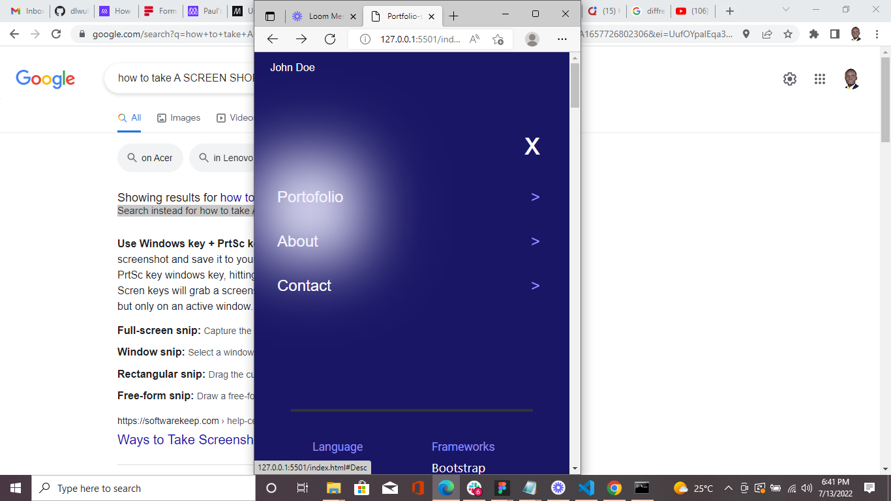

# My-Portfolio-setup-Desktop-version & Mobile

> A Personl Portifolio for All Devices including Mobile Devices.

## Built With

- HTML & CSS
- Github
- VScode

## Live Demo (checkout the Live Demo Below)

[APP Link](https://canon20paul.github.io/My-Portfolio-setup-Desktop-version/)

[Live Demo Link](https://www.loom.com/share/67c15e1fd2ae4b09805e50bf36fd98a8)

## Getting Started

**One uploaded online, this Pages can be accessed through Standard Devices with Resolutions of up to 1200px like Desktop computers Mobile devices with Screens as low as 350px.**

>Desktop Version

>Tablet Version

>Mobile phone Version

To get a local copy up and running follow these simple example steps.

### Prerequisites
-Any Web Browser (Preferably updated)

### Usage
Capture an individual's Work Portofolio.

### Run tests
-Css error Tests Passed.
-Html Error Tests passed.
-Tested on devices of as low as 300pxs.
-Tested on screens as large as 1200pxs
### Deployment
Any webhost Preferably Github pages

## Authors

👤 **Paul Malongo**

- GitHub: [@Canon20paul](https://github.com/githubhandle)
- Twitter: [@Paulmalongo](https://twitter.com/twitterhandle)
- LinkedIn: [paulmalongo](https://linkedin.com/in/linkedinhandle)

## 🤝 Contributing

Contributions, issues, and feature requests are welcome!

Feel free to check the [issues page](../../issues/).

## Show your support

Give a ⭐️ if you like this project!

## Acknowledgments

- Microverse Community
- Family

## 📝 License

This project is [MIT](./MIT.md) licensed.
